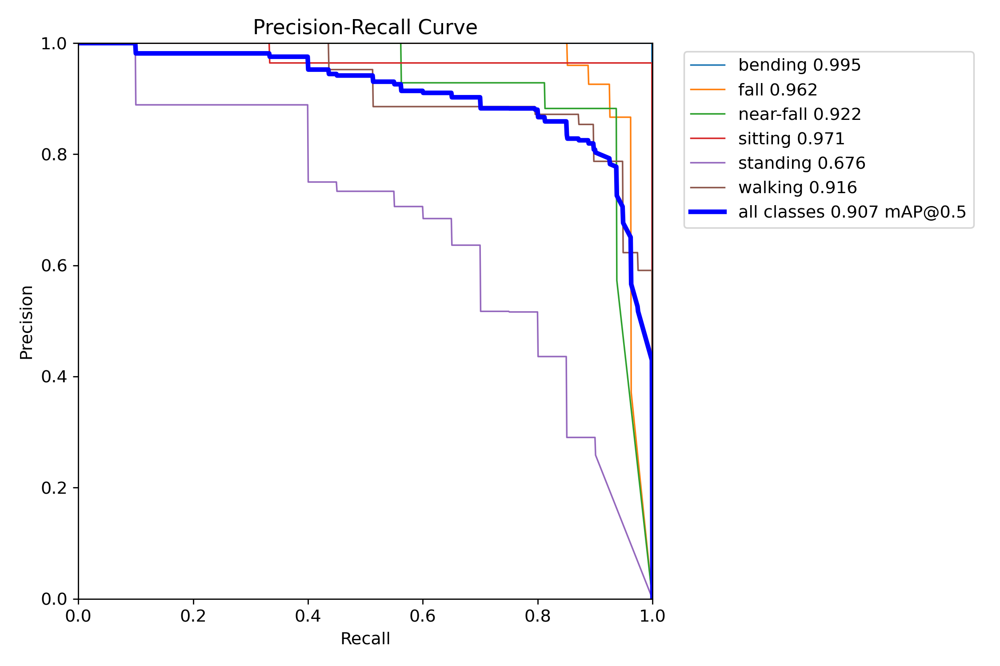

# 基于深度学习的动作识别检测预警系统
## 项目功能分析

这是一个基于深度学习的动作识别系统，主要功能包括：

1. **图像识别**：可以识别静态图片中的人体动作姿态
2. **视频识别**：可以处理视频文件中的人体动作
3. **摄像头实时识别**：通过连接摄像头实时识别动作
4. **批量图像处理**：支持批量处理图像文件夹
5. **结果保存**：可以保存检测结果视频和图像

系统能够识别的动作类别包括：
- 屈身
- 摔倒
- 将要摔倒
- 坐下
- 站立
- 行走

这些动作类别对应的英文标签为：crouch, fall, near-fall, sitting, standing, walking。

## 运行效果
1.准备测试图片数据

2.启动程序

3.模型启动成功

4.动作行为识别

5.大模型识别耗时

大模型，数据分析（模型预测、神经网络、等）

## 技术栈

项目使用的主要技术包括：

1. **深度学习框架**：
   - YOLOv8：用于目标检测的深度学习模型
   - PyTorch (torch)：深度学习框架，版本1.9.0

2. **GUI开发**：
   - PyQt5：用于构建图形用户界面，版本5.15.2
   - pyqt5-tools：PyQt5的工具集，版本5.15.2.3.1

3. **图像处理**：
   - OpenCV (opencv-python)：用于图像和视频处理
   - PIL (Python Imaging Library)：用于图像处理和绘制

4. **数据处理与可视化**：
   - NumPy：用于数学计算
   - Matplotlib：用于数据可视化
   - Seaborn：用于统计数据可视化

5. **其他辅助库**：
   - tqdm：用于显示进度条
   - psutil：系统信息监控
   - requests：HTTP库

## 环境要求

根据requirements.txt文件，项目的主要环境要求为：

1. Python环境（建议3.7+）
2. PyTorch 1.9.0
3. Ultralytics 8.0.199（YOLOv8框架）
4. PyQt5 5.15.2
5. OpenCV 4.8.1.78
6. 其他依赖库

项目提供了installPackages.py脚本来安装主要依赖包。

## 工作流程

系统的主要工作流程如下：

1. **初始化**：
   - 加载YOLOv8模型（models/best.pt）
   - 初始化GUI界面
   - 设置默认参数（置信度阈值0.25，IOU阈值0.7）

2. **图像识别流程**：
   - 用户选择图片文件
   - 系统加载图片并进行预处理
   - 使用YOLOv8模型进行目标检测
   - 绘制检测框和标签
   - 在表格中显示检测结果（类别、坐标、置信度）
   - 可以通过下拉框选择查看特定的检测目标

3. **视频识别流程**：
   - 用户选择视频文件
   - 系统逐帧读取视频
   - 对每一帧应用YOLOv8模型进行检测
   - 实时显示检测结果和目标信息
   - 可以保存处理后的视频

4. **摄像头识别流程**：
   - 用户点击开启摄像头
   - 系统获取摄像头实时画面
   - 对每一帧应用YOLOv8模型进行检测
   - 实时显示检测结果和目标信息

5. **批量图像处理**：
   - 用户选择图像文件夹
   - 系统批量处理所有图像
   - 保存检测结果

整个系统通过QThread多线程处理来保证UI的响应性，特别是在视频处理和摄像头实时检测过程中。

## 项目结构

项目的主要组成部分：

1. **主程序**：MainProgram.py - 系统的主要逻辑和界面控制
2. **检测工具**：detect_tools.py - 提供图像处理和检测相关功能
3. **配置文件**：Config.py - 存储系统配置参数和类别信息
4. **UI组件**：UIProgram目录下的文件，如UiMain.py定义了界面布局
5. **模型文件**：models目录下存储训练好的YOLOv8模型
6. **测试文件**：多个测试脚本如imgTest.py, VideoTest.py等
7. **安装脚本**：installPackages.py用于安装依赖

这是一个完整的动作识别系统，包括了从数据处理、模型应用到用户界面的全套功能。系统采用了模块化设计，各个组件职责明确，便于维护和扩展。
